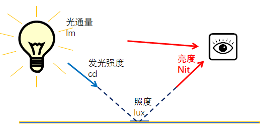

# 显示器

* 尺寸

* 分辨率

* 刷新率

* 颜色

  * 色域 (影响颜色范围)

    * sRGB

    > 100%sRGB=75%NTSC

    * NTSC
    * Adobe RGB
    * DCI-P3
    * REC.2020
    * ProPhoto RGB

  

  * 色准 (影响色彩准确度) 
    * $\Delta E$越小越准确
    * 可通过校色器后期软件校准
  * 色深 (影响颜色过渡是否平滑)
    * 单位为bit, 一个颜色由xx位二进制数表示
    * 一个像素点由红、绿、蓝三个子像素点构成，所以一个像素点的颜色种类为$({2^{色深}})^3$
    
    >  **6bit**  :26.2万色 
    >
    >  **8bit** :1670万色

* 面板材质

  * TN**（Twisted Nematic）扭曲向列**（一般淘汰，虽然响应速度快）

  * VA**（Vertical Alignment）垂直配向**

  * IPS**（In-Plane Switching）平面转换**（有fast ips子类型提高相应速度）

  * OLED**（Organic Light-Emitting Diode）有机自发光**

    > MiniLED**（背光层技术，非面板类型）**: 背光曾LED灯珠分区、排布的改善技术（原背光层灯珠一般为侧入式，容易发生漏光，全阵列LED改善）

    > CRT (cathode ray tube)
    >
    > LCD (liquid crystal display)

    

* 亮度

  * 单位是nit, $L=\frac{I}{A}(A=发光面积)$

  > | **光通量**（Luminous Flux）    | Φ    | **流明（lm）**        | **光源发出的总可见光功率**        |
  > | :----------------------------- | :--- | :-------------------- | :-------------------------------- |
  > | **光强**（Luminous Intensity） | I    | **坎德拉（cd）**      | **特定方向的发光密度**            |
  > | **照度**（Illuminance）        | E    | **勒克斯（lx）**      | **被照面接收的光通量密度**        |
  > | **亮度**（Luminance）          | L    | **尼特（nit=cd/m²）** | **光源/反射面进入人眼的发光强度** |

  

* 对比度

  * 显示器最大亮度（白场） / 最小亮度（黑场）

    | **原生对比度**（静态） | 全屏白 vs 全屏黑 | OLED屏≈无限:1 IPS屏≈1000:1 |
    | :--------------------: | :--------------: | :------------------------: |

  * 显示器使用DisPlayHDR技术:warning:

    * HDR400 = 对比度1000:1(似乎)

* 响应时间

  * 拖影
  * 过冲鬼影