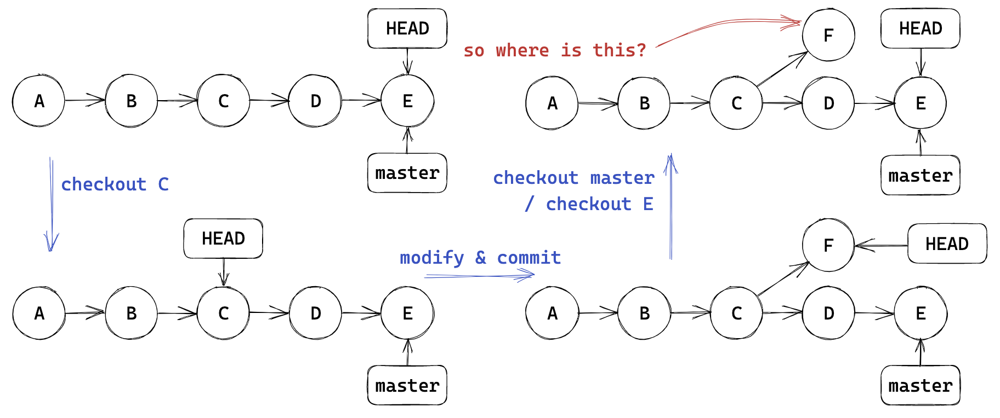
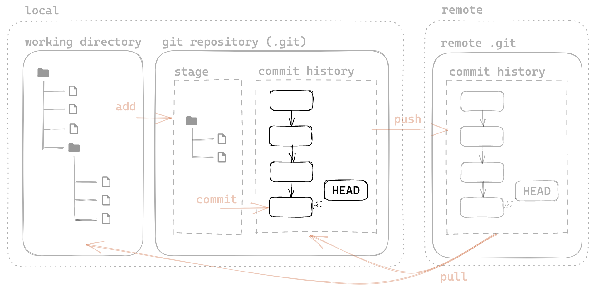
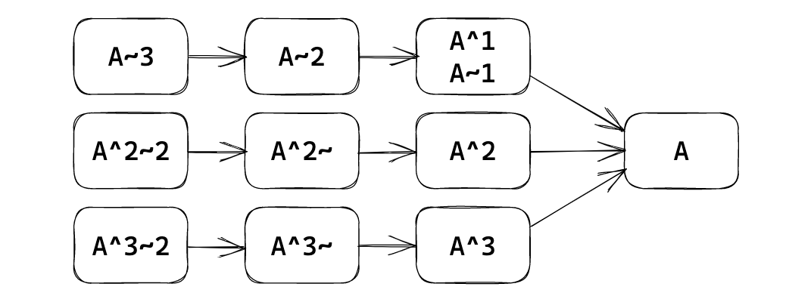
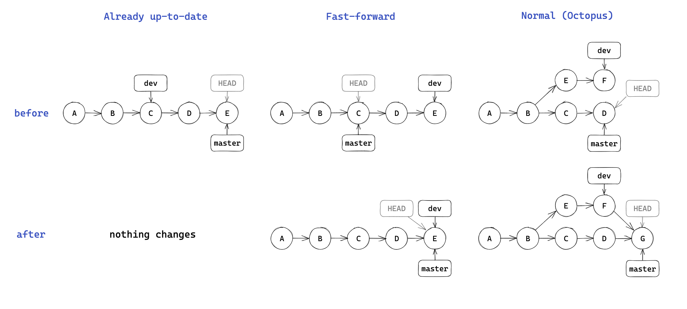
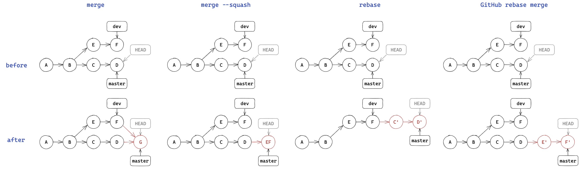
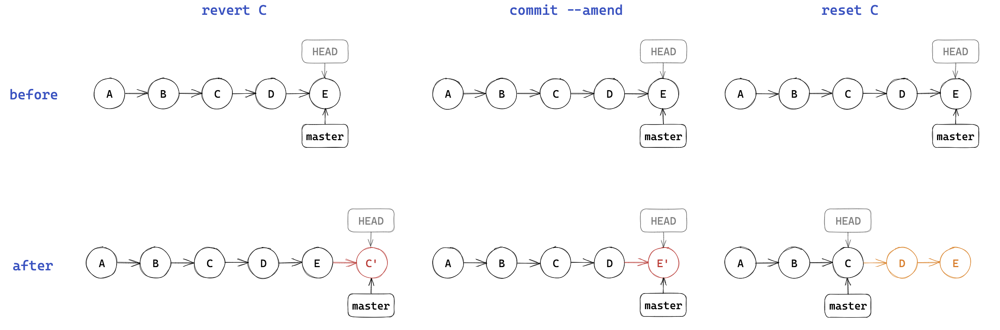
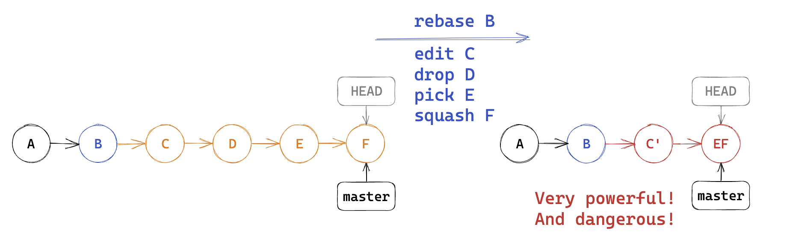
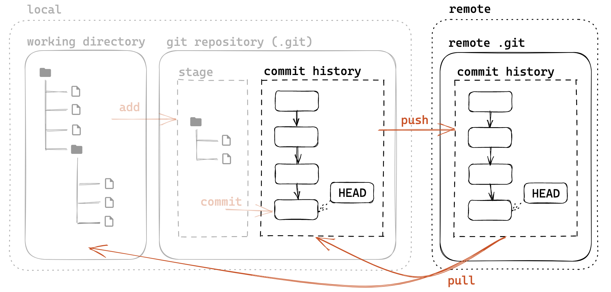
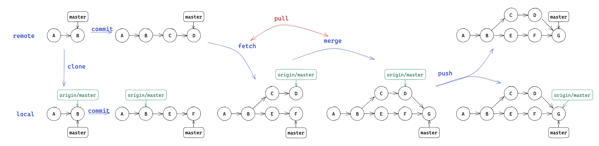

> 教程资源
>
> [lec2 - 2023春夏实用技能拾遗](https://slides.tonycrane.cc/PracticalSkillsTutorial/2023-spring-cs/lec2/#/3/4)

[toc]

# Git 基础配置

（需要修改）

* 
  创建一个本地版本库
  * 'git init' 
    * git init: 让当前文件夹变成git仓库 (创建 .git文件夹)
    * git init folder:
* git账号配置
  * git config --global user.name "name"
  * git config --global user.email "email"
    * 区分用户 / 让GitHub识别
    * 全局配置
    * 针对某一版本库专门设置
      * 同前, 不加--global


# Git基础用法

## 文件暂存

* 将文件加入暂存区stage中
  * git add file/folder
    * 只会添加修改过的文件	
* 删除文件
  * rm
    * 只在本地删除版本库commit history中不存在的文件
  * git rm
    * 同时删除本地和版本库中的文件
    * 相当于先rm, 再add
  * git rm --cached
    * 将一个一暂存的新文件取消暂存
* 重命名文件
  * git mv
    * 等价于mv + git rm + git add
* 查看当前工作区和暂存区状态
  * git status
    * Untracked \ Tracked \ Igonored

## .gitigonore❓

- 存放在版本库根目录下的名为 .gitignore 的文件，规定忽略哪些文件
- 语法
  - \# 开头的行为注释
  - \* 通配多个字符，** 通配中间目录（有或无）
    - *.c 匹配所有 C 文件，a/**/b 匹配 a/b、a/x/b、a/x/y/b 等
  - / 开头只匹配根目录，否则匹配所有目录
  - ! 取消忽略
  - ...
  - [Git - gitignore Documentation](https://git-scm.com/docs/gitignore)
- git check-ignore -v *file*：查看某个文件是否被忽略，以及匹配的规则
- 常用语言的 .gitignore 模板：[github/gitignore](https://github.com/github/gitignore)

## 提交更改

* 将暂存stage中的内容提交到本地仓库 (本质上是一个提交历史), 生成一个新版本

  * git commit
    * 默认编辑器编辑提交信息
    * -m "message"
    * -a | --all: 自动暂存所有更改的文件（仅对已track的文件的更改生效，即已经add过的文件生效）

* 查看提交历史

  * git log
    * --oneline: 每一个提交一行
    * --graph: 显示分支结构
    * --stat: 显示文件删改信息
    * -p: 显示详细的修改内容

* 显示提交详细信息

  * git show id: 显示提交详细信息 (id不重复前提下可以只写前几位)

>  每个提交都有唯一的sha-1标识符 (40位16进制数)

* 检出之前的某一版本

  * git checkout id
  
    > 如果本地修改的文件在目标提交中没有被更改，或者目标提交和原分支中的该文件版本相同，那么切换时Git不会覆盖该文件，从而保留修改。只有当目标提交中的该文件与原分支中的版本不同，并且用户的本地修改与目标提交中的该文件冲突时，Git才会阻止切换。

## 关于commit message

- 意义是什么：记录更改的原因 / 内容，方便定位 / 回溯（特别是合作项目）

- Angular 规范（来源：[angular/angular:CONTRIBUTING.md](https://github.com/angular/angular/blob/main/CONTRIBUTING.md#-commit-message-format)）

  ```
  <type>([scope]): <summary>
  
  [body]
  
  [footer]
  ```

  - type：更改类型（fix/feat/docs/refactor/perf/test/ci/...）
    - 重大更改可以写 BREAKING CHANGE 或 DEPRECATED（全大写）
  - scope：影响范围（可选，比如具体影响的模块等）
  - summary：更改的简要描述，英文一般现在时，首字母小写句末无句号
  - body：详细描述，可选
  - footer：解决 issue 了可以写 Fixes #*id* 或 Closes #*id*

## 关于版本

- 创建标签：
  - git tag *tag* *id*
    - 轻量标签
    - *id* 可选，默认为 HEAD
  - git tag -a *tag* -m "*message*" *id*
    - 附注标签
- 查看标签
  - git tag
- 版本号命名一般规范：Semantic Versioning 2.0.0
  - v*主版本号*.*次版本号*.*修订号*[-*预发布版本号*]
  - 修订号：兼容修改，修正不正确的行为
  - 次版本号：添加新功能，但是保持兼容
  - 主版本号：不兼容的API修改
    - 且为 0 时表示还在开发阶段，不保证稳定性
  - 预发布版本号：alpha/beta/rc.1/rc.2/...
  - e.g. v1.0.0-beta < v1.0.0-rc.1 < v1.0.0 < v1.0.1

> git diff A B(分别对应ab, a用- ,b用+,最好设置A为旧文件,B为新文件)

# detached HEAD 问题

* HEAD：通常指向**当前（工作区）所在的分支**。
  * 例如，当你在 `main` 分支时，`HEAD` 指向 `main` 分支，而 `main` 分支又指向最新的提交。
* detached HEAD: HEAD指向某个历史提交，而不是某个分支
* 什么情形会出现detached HEAD
  - git checkout *id*，此后的修改不会出现在任何分支
  - 切换回 master 后会出现一条不属于任何分支的提交（相当于修改会丢失）



- 如何解决：在 F 的位置上 git checkout -b *branch* 创建并检出新分支

# 分支



- 创建分支
  - git branch *name*：基于当前 HEAD
  - git branch *name* *id*：基于 *id* 提交:warning:
- 查看分支
  - git branch（带 -a 显示远程分支）
  - git show-branch 更详细
- 切换分支
  - git checkout *name*
  - git checkout -b *name*：创建并切换
- 内容比较
  - git diff *branch1* *branch2*：比较两个分支
  - git diff *branch*：比较工作区和分支
  - git diff：比较工作区和暂存区
  
- 如何更方便地定位提交
  
  - 什么是分支名：和 HEAD 一样，也是一个指针（实际上叫引用 ref）
  - 可以基于 ref  使用 ~  或 ^  定位父提交
    - ~ 表示第一个父提交，~2 表示第一个父提交的第一个父提交
    - ^ 表示第一个父提交，^2 表示第二个父提交
  - 一个提交可能会有多个父提交（merge commit）
  
  

# 合并

- 将多个分支的更改都合并到当前分支：git merge *branch1* *branch2*...

* 几种 merge 的情况

  - 当前分支只比被合并分支多提交：already up-to-date

  - 被合并分支只比当前分支多提交：fast-forward（将 HEAD 指向被合并分支）

  - 都有新的提交：产生一个merge commit
    - 有冲突需要手动解决冲突（add 后再次 commit 生成 merge commit）



* 实际上 merge 操作一般都在 GitHub 上通过 PR 完成，两种特殊的 merge 方法：

  - squash merge：将目的分支多出的所有提交压缩为一个新提交并入当前分支

  - rebase：变基
    - 命令行直接rebase 会将当前分支接到目标分支后
      - 这种情况会导致提交历史更改，同步会有冲突，合作时不推荐
    - 通过 GitHub PR rebase merge 会将目标分支接到当前分支后



# 修改提交历史

- git 的提交历史也并不是完全不可修改的，有几种方式可以进行强制修改
- ❗️如果项目已经公开，且有其他人协作，那就不应该修改任何提交历史

几种修改的方式

1. 不算是修改的修改：git revert id:warning:

   - 生成一个新的提交，将目标提交的更改撤销
   - 历史的所有提交都不会改变

2. 修改最新提交的提交信息：git commit --amend

   - 会弹出编辑器编辑提交信息（或直接用 -m "*message*" 指定）
   - 只会修改最新提交的提交信息
   - 本质上修改了提交历史记录，不建议在协作时使用

3. 回到之前某一提交的状态：git reset id

   - 几种模式：
     - --soft：只修改 HEAD 指针，不修改暂存区和工作区
     - --mixed：修改 HEAD 指针和暂存区，不修改工作区（默认）
     - --hard：修改 HEAD 指针、暂存区和工作区（完全回退）

   

4. rebase：:warning:

   - 前面说到的 rebase merge 是在不同分支之间变基的情况
   - rebase 也可以用在同一分支上，表现为修改提交历史
   - git rebase -i id：交互式rebase
     - 会弹出编辑器，可以对提交进行编辑，顺序从上到下
     - pick：保留该提交
     - edit：保留该提交，但会进入编辑状态
     - squash：将该提交和上一个提交合并
     - drop/ 删除整行：删除该提交

   

# 远程版本库

- 想一想 Git 这样的分布式 VCS 如何实现协作

- 使用一个远程的“权威”版本库（remote repository）

- 远程版本库也是一个普通的git 版本库

  - 通过git clone src dest 可以将远程版本库克隆到本地

    - 会自动建立 remote 关联，可通过 git remote 管理

  - git remote add origin `https://github.com/你的用户名/仓库名.git`

    - origin：远程仓库名，即地址别名

  - git push 

    会将本地的提交推送到远程版本库
  
    - 无法直接 push 到远程版本库检出的分支中
    - 因此远程一般使用裸版本库（--bare）

  - git pull 

    会将远程版本库的提交拉取到本地
  
    - 包含 git fetch 和 git merge 两个步骤



# 如何理解远程版本库

- 可以当作本地的一个 origin/master 分支
  - \* 后面会提到，实际上是在另一个命名空间 remotes 中
- 多的功能只有 fetch 更新这个分支，以及 push 推送到远程



最后，如何让合作的人都能访问到远程版本库？

- 放在服务器上通过 SSH/HTTPS/Git 原生协议等访问
- 更方便的，放在 GitHub/GitLab 等托管网站上
