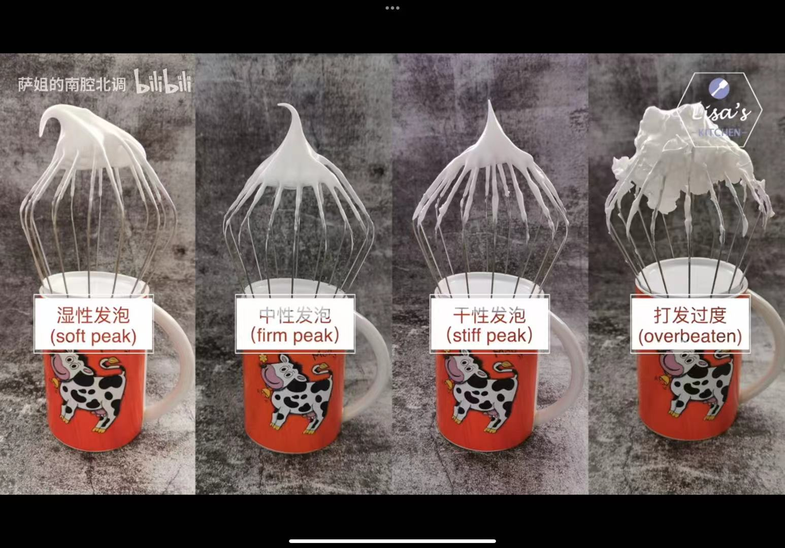
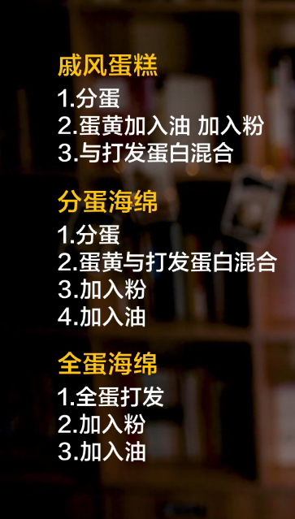

[toc]

# 基础烘培知识

##  面粉

* 筋度--面筋:warning:（主要成分：蛋白质）的含量

  * 小麦由外往内蛋白质含量升高, 筋度升高
  * 最外层筋度最低

* 三种面粉

  > 中式面点不太区分

  * 低筋面粉（饼干、蛋糕  <9.5%）
  * 中筋面粉 (9.5%~11.5%)
  * 高筋面粉（面包 >11.5%）

* 乳化：油水相融

  * 在烹饪过程不使用乳化剂的实现方式
    * 少量多次
    * 电动打蛋器

* 起筋 | 出筋

## 黄油

* 定义: 牛奶分离出的高纯度固态乳脂
* 天然乳脂黄油分类
  * 根据味道
    * 有盐 (适合佐餐)
    * 无盐 | 淡味黄油 (适合西点烘焙)
  * 根据工艺
    * 非发酵型黄油
    * 发酵型黄油 (有额外风味)
* 使用状态
  * 固体状态
    * 冷藏略硬 (适用黄油和粉类初步揉搓混合再混合液体, 如酥粒\派皮)
    * 室温软化 (黄油先混和液体, 常见于饼干) 
      * 软化不好的缺陷 | 问题
        * 水油分离 (太硬导致)
        * 不好包裹空气
  * 液体状态 | 融化状态 (推荐隔水融化)

## 鸡蛋

* 烘焙常见四大食材
  * 黄油
  * 面粉
  * 糖
  * 鸡蛋
* 使用状态 (膨胀效果 由低​到高​)
  * 不打发的全蛋
  * 不打发的蛋白
  * 打发的全蛋
  * 打发的蛋白

## 奶油 | 淡奶油 (因为不含糖)

* 定义: 从牛奶中分离出来的具备一定脂肪比例的液体状天然乳脂
* 分类: 根据乳脂含量 (乳脂含量越高, 奶味越浓, 越容易打发)
  * 双倍奶油 (double cream): 
  * 重奶油 (heavy whipping cream): 更易打发\稳定 (37%~40%)
  * 搅打奶油 (whipping cream): 用于打发抹面 (30%~36%) (==最常用==)
  * 轻奶油 (light cream): 无法打发抹面, 可用于慕斯 (18%~28%)
  * 半脂奶油 (half and half cream): 冲泡咖啡\直接添加 (10%~18%)
* 由于淡奶油不含糖, 所以根据口味添加味道
  * 糖:奶油=1:10 (一般)
* 打发（蛋白打发如果有蛋黄、油，就容易出现水油分离）
  * 过程: 通过电动打蛋器的高速旋转让奶油不断的包进空气, 从而让液体的奶油变成可以出现固体:warning: (液体到出现纹路到打发完成)
  * 电动打蛋器开始中低速(防止奶油飞溅), 中高速(有一定粘稠度), 中低速(有纹路, 观察状态)
  * 奶油最适合的打发温度是4度, 确保奶油打发前充分冷藏 (夏天还要冷藏容器\在冰水上打发)
  * 打发状态 (奶油包裹空气多少, 有一个包裹空气能力的上限)
    * 6-7分: 微微出现纹路且会流动 (慕斯) (7分发添加非奶油物质, 如可可粉\抹茶粉, 添加过后打发过程加快)
    * 8分: 纹路变得明显且不消失 (提拉米苏)
    * 9-10分发: 变硬\成型, 打蛋勾周围出现空隙 (裱花\抹面)
    * 打发过度(很快, 慢下来细心观察): 粗糙\有颗粒感, 水油分离
* 打发状态
  * 湿性发泡（soft peak）：大弯钩（蛋糕卷）
  * 中性发泡（firm peak）：小弯钩
  * 干性发泡（stiff peak）：直立（戚风、分蛋海绵、马卡龙）
  * 过度打发（overbeaten）：成团

## 芝士 | 奶酪 | 乳酪

* 基本状态：发酵、酸性固体状
* 分类
  * 根据含水量不同
    * 软 （马斯卡彭芝士 、奶油芝士）
    * 中软
    * 中硬
    * 硬质 （切达芝士、帕马森芝士）
* 三大烘焙芝士
  * 奶油芝士（芝士蛋糕）
    * 质地软，水分含量高
    * 解冻之后呈颗粒状，类似水油分离状态下黄油霜（隔水加热，并搅拌以顺滑）
    * 芝士蛋糕
      * 轻芝士蛋糕（奶油芝士含量比较低），质地轻盈，淡淡芝士风味
      * 重芝士蛋糕（奶油芝士含量比较高），浓郁芝士风味，一般有饼底搭配（消化饼、奥利奥饼）
      * 冻芝士蛋糕，类似慕斯
  * 马斯卡彭芝士 （提拉米苏）
    * 未经过发酵，凝结的淡奶油，保质期短
  * 马苏里拉芝士 （披萨、焗饭、千层面）
* 推荐品牌
  * 凯瑞、安佳、卡士

# 基础烘焙

## 泡芙

* 组成
  * 馅
  * 泡芙皮
  * 酥皮 (提升口感, 帮助定型, 让泡芙皮膨胀更自然成半圆形)

* 泡芙皮难点
  * 用来烫面的液体要完全沸腾 (最剧烈沸腾后, 面粉立刻筛入液体)
    * 未沸腾: 泡芙含有的空气不够
    * 沸腾过久: 水分丧失太多
  * 烫过的面还要开小火去翻炒 (翻炒,碾压,再翻炒), 避免面粉糊化不彻底 (翻炒到容器底部结一层薄薄的痂)
  * 面团放到温温的状态, 可以拌压帮助散热
    * 过热: 烫熟鸡蛋影响膨发
    * 过冷: 影响鸡蛋的吸收
  * 鸡蛋选用新鲜常温鸡蛋
    * 凉: 黄油发硬,改变面糊延展性, 影响观察, 需要提前回温
  * 鸡蛋液分多次加入面糊, 手法以切拌\按压为主, 彻底吸收再加 (但也不能过度搅拌, 会破环面团延展性\弹性)
  * 到最后面糊状态应为有粘性\不易脱落\边缘平滑, 8-10公分的三角状就可以不用添加
    * 鸡蛋液过多: 面糊太稀, 泡芙扁扁的
    * 鸡蛋液过少: 泡芙又小又硬, 空心不够
  * 烤制 (烤制过程千万不能打开烤箱, 冷风会回缩塌陷)
    * 上下火 热风 190度 10-15分钟: 短时间快速膨胀到最大
    * 170度 10-15分钟: 定型
    * 150度 5-8分钟: 巩固形状,考掉多余水分 (泡芙膨胀裂纹里微微上色发黄)
  
  > 蛋白打发: 乳化, 混合气体与液体
  >
  > 蛋白打发成蛋白霜, 蛋黄与面粉混合制成面糊
  
  ## 戚风与海绵
  
  * 特点
    * 戚风：高度更高、容易变形、清新柔软
      * 分蛋法
    * 海绵：承托性好、不易变形、绵密干燥
      * 分蛋法
      * 全蛋发
  * 制作方法（区别在于投料顺序）
    * 戚风：将投料与蛋黄先单独处理，在混合蛋白（最后混合蛋白，蛋白比较稳定，消泡较少：空洞丰富、容易长高；容易回缩）
    * 海绵：将鸡蛋单独处理，再混合投料（蛋白消大气泡：气孔均匀、长高较少；不易回缩、有较好承托性）

 