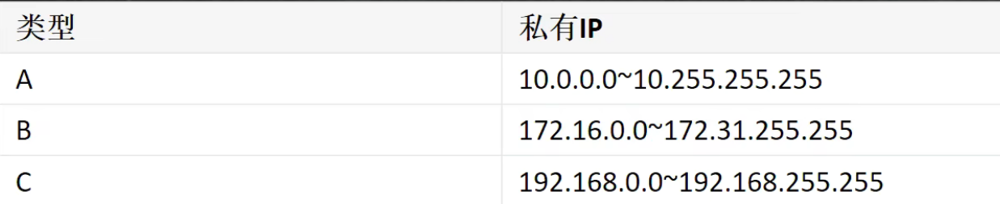
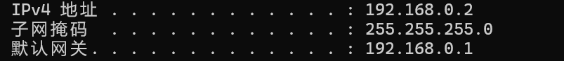
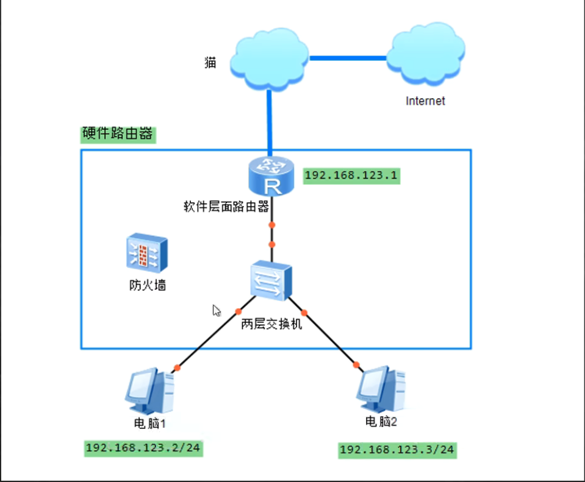
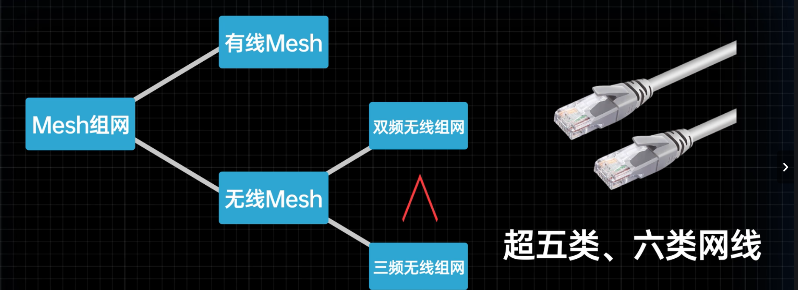
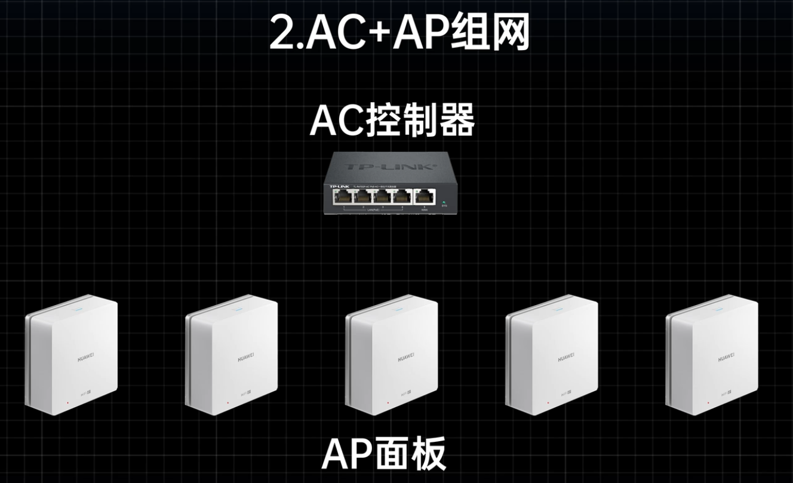
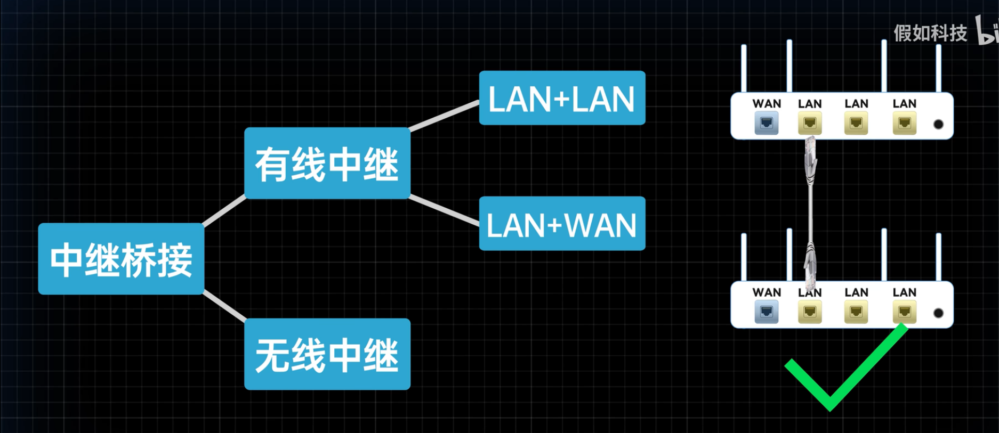

* LAN（Local Area Network）- 入口

* WAN（Wide Area Network）- 出口

* 连结方式
  * 以太网（Ethernet - 有线）
  * Wi-Fi（无线）

* AP（Access Point，无线接入点）

* ISP (Internet Service Provider)

* 服务器 - 互联网 - 运营商 - 宽带 - 猫（Modem/ONT Optical Network Terminal） - 路由器（Router） - 终端

* 上网方式
  * 宽带拨号上网
    * PPPoE（Point-to-Point Protocol Over Ethernet，以太网点对点协议）
    * 拨号上网，使用ISP提供的账号密码进行拨号认证
    * 对应光猫桥接模式上网（光猫仅执行光电转换，账号密码存储于路由器中）
  * 自动获取IP上网
    * DHCP（Dynamic Host Configuration Protocol，动态主机配置协议）
    * 自动获取IP地址，通常为光猫在路由模式下自动获取
    * 对应光猫路由模式上网（光猫执行部分路由功能，如IP地址分发、NAT转换）
  * 静态IP （手动配置 ISP 提供的固定公网 IP 地址、子网掩码、网关、DNS）
  
* 公网IP vs. 私网IP
  * 公网IP（全球唯一，由ISP分配，可直接访问公网）
  * 私网IP（由DHCP分配，需通过NAT转换访问公网）
  
  
  
* NAT（Network Address Transmit 网络地址转换)

* IP地址（Internet Protocol Address）
  * 组成（以IPv4为例）
    * 网络号（前三部分十进制数
    * 主机号
  * 类型
    * IPv4（32位二进制数，一般用4部分十进制数表示）
    * IPv6（128位二进制数）

* 子网掩码（Subnet Mask）
  * 用于划分IP地址网络部分和主机部分
  
* 网关（Gateway）

  * 每一层级的路由器（家庭、小区、区、市...)都有网关，通过网关判断是否处于同一网段下，来提高传输的效率
  * 同一网段可以直接通信，无需经过网关
  
  > 网关与公网IP不同，网关属于Router的LAN口，公网IP属于Router的WAN口
  >
  > 网关有一层层，公网IP唯一（对于IPv4来说，许多设备共用同一公网IP，所以无法通过公网直接锁定特定设备，需要经过反向NAT）
  >
  > 所有路由器都具有NAT功能，但只有ISP的路由器具有公网IP，最终能接上因特网
  

  > 
  >
  > IP地址与子网掩码进行与运算得到网络号
  >
  > 192.168.0.0为网络号（网络号相同为同一网段，用于判断是否为同一子网，能否直接进行通讯）
  >
  > 2为主机号
  >
  > 

* DNS服务器

* 指令

  * ` ipconfig`
  * ` tracert -d IP`：-d是用于不将ip地址解析为主机名
  * ` nslookup DNS` 

* 端口

  * 物理端口
  * 软件端口：软件通过监听端口来确认数据包是否发送给自身

  > 软件与端口是一对多的关系
  >
  > style: **IP:Port**

* DHCP光猫拨号，PPPoE路由器拨号

* 路由改桥接

* 组网方式

  * Mesh组网

    * 支持无缝漫游

    

    > 漫游:支持在多个无线网络间自动切换

  * AC+AP组网 (光猫本身作为AC)

  

    * 路由器中继/桥接组网

  

>1.没有特殊需求的情况下，NAT应当尽量少，最好所有设备同处于一个局域网中，按你教的方法，第一种，两个路由器各自形成了一个局域网，第二种方法，第二个路由器在第一个路由器形成的局域网中又增加了一个局域网。2.如果只保留一层NAT，如果光猫做路由，那就将两个路由器设置成ap模式，和光猫的千兆口连接，接线方式没有讲究，如果光猫桥接，就将其中一个路由器作为主路由进行拨号，另一个路由作为ap和主路由的lan口连接

> 组网相关思考关键在于
>
> 执行什么功能\是否已经存在
> 几层NAT
> 是否位于同一局域网下

* [x] 组网方式

* [x] 上网方式

* [x] 路由器/光猫拨号

* [ ] 当前采取中继上网，中继路由器位置对信号强度的影响，功率、穿墙、直线传播

* [ ] 苹果手机开启ipv6、apn设置

* [ ] 公网串流设置相关知识

