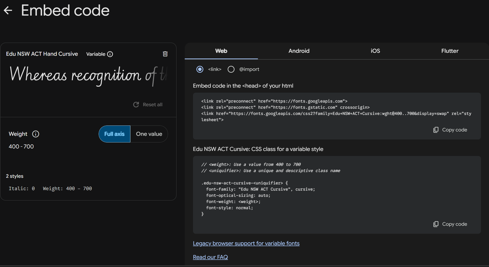

* 注释`/*	*/`
* 浏览器将默认样式应用于 `<h1>` 元素

>  没有border, 且padding-top为0时
>  \<body>的background-color只能覆盖content(纵向), 会从第一个content的border开始
>  又由于\<h1>有默认margin-top, 所以\<body>的background-color在没有border时上方会有一块被\<html>的background-color覆盖
>  可以通过将\<h1>margin置0, 或是添加\<body>的border解决

* html元素类型

  * block（块级）
  * inline（行级|内联）

* 语法

  * **规则集**（Rule）（简称为规则）

    - 选择器（Selector）

    - 声明（Declaration）：一条单独的规则（如 `color: red;`）。用来指定为元素的哪个**属性**添加样式。

      - 属性（Properties）eg.`color`
      
        - 属性值（Property value）eg.`red`
      
  
    > 除了选择器部分，每个规则集都应该包含在成对的大括号里（`{}`）。
    > 在每个声明里要用冒号（`:`）将属性与属性值分隔开。
    > 在每个规则集里要用分号（`;`）将各个声明分隔开。

  * 同时修改多个属性，只需要将它们用分号隔开，就像这样：
  
    ```css
    p {
      color: red;
      width: 500px;
      border: 1px solid black;
    }
    ```
  
  * 选择多个元素,多个选择器之间用逗号分隔。例如：
  
    ```css
    p,
    li,
    h1 {
      color: red;
    }
    ```

* 选择器

   | 选择器名称                           | 选择的内容                                                   | 示例                                                         |
    | :----------------------------------- | :----------------------------------------------------------- | :----------------------------------------------------------- |
    | 元素选择器（也称作标签或类型选择器） | 所有指定类型的 HTML 元素                                     | `p` 选择 `<p>`                                               |
    | ID 选择器                            | 具有特定 ID 的元素。单一 HTML 页面中，每个 ID 只对应一个元素，一个元素只对应一个 ID | `#my-id` 选择 `<p id="my-id">` 或 `<a id="my-id">`           |
    | 类选择器                             | 具有特定类的元素。单一页面中，一个类可以有多个实例           | `.my-class` 选择 `<p class="my-class">` 和 `<a class="my-class">` |
    | 属性选择器                           | 拥有特定属性的元素                                           | `img[src]` 选择 `` 但不是 ``     |
    | 伪类选择器                           | 特定状态下的特定元素（比如鼠标指针悬停在链接上时）           | `a:hover` 选择仅在鼠标指针悬停在链接上时的 `<a>` 元素        |

* 添加字体[Google Fonts](https://fonts.google.com/?hl=zh-cn)

  * 分别在.html 和 .css文件中复制网站上的引导

  

* 设置字号常用属性

  * `font-size`
  * `text-align`
  * `line-height`
  * `letter-spacing`

* Box model(盒子模型)
  > Block Element：CSS 布局主要是基于**盒子模型**。每个在页面上占用空间的盒子都有类似的属性
  > Inline Element：如可以用`display:block`来获取block元素的基本属性
  
  * `padding`（内边距）
  * `border`（边框）
  * `margin`（外边距）
  
  > 对于padding和border
  > 两个值代表: 上下, 左右
  > 四个值代表: 上, 右, 下, 左
  
  


- 其他
  - `width`：元素的宽度
  - `background-color`：padding和content（即border以内）的颜色
  - `color`：元素内容（通常是文本）的颜色。
  - `text-shadow`
    - 第一个像素值设置阴影与文本的**水平偏移量**：阴影水平方向移动的距离（译者注：向右为正值）。
    - 第二个像素值设置阴影与文本的**垂直偏移量**：阴影垂直方向移动的距离（译者注：向下为正值）。
    - 第三个像素值设置阴影的**模糊半径**。值越大产生的阴影越模糊。
    - 第四个值设置阴影的基色。
  - `display`
