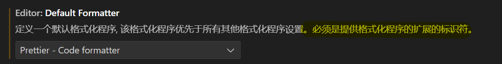

* :question:

* **推荐使用全小写、不带空格、并用连字符 `-` 分隔单词**
* 在命令行中操作时，空格是用来分隔不同命令或参数的
  * 必须费力地加上引号（`"my file.txt"`）或反斜杠（`my\ file.txt`）来告诉系统这是一个整体，非常不方便且容易出错。
* Google（以及其他主流搜索引擎）明确将连字符 `-` 视为单词分隔符（**替代空格作用**），而将下划线 `_` 视为单词连接符 （**SEO**）
  * 搜索引擎搜索时前者更容易出现高相关性
* Windows 的文件系统使用反斜杠而不是正斜杠，例如：`C:\Windows`
  * 这在 HTML 中并不重要——即使你在 Windows 系统上进行开发，你也应该在代码中使用正斜杠。
* 当内容分辨率与显示器分辨率不相同时如何处理:question:
  * 分辨率一定符合横纵比吗